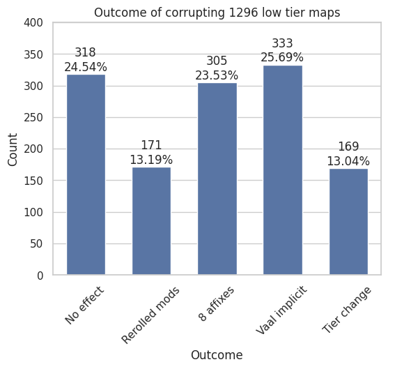

# Map corruption outcomes

A joint project of Elinvynia and staticf0x to determine the outcomes
of corrupting maps with Vaal Orbs. The possible outcomes are
described on [PoE wiki](https://www.poewiki.net/wiki/Vaal_Orb#Maps).

# Methodology

We gathered the maps into separate stash tabs, then used
[divcards2gsheet](https://github.com/staticf0x/divcards2gsheet/tree/snapshot)
to obtain the stash tab snapshots before spamming Vaal Orbs and after.

After that, we used the script `compare.py` inside this repository
to find the changes between the two snapshots.

Run the script as: `python3 compare.py before.json after.json`.

This also creates a CSV with the outcomes. The included Jupyter notebook
`Analysis.ipynb` will then join all the outcomes CSVs (folders `outcomes/t16` and
`outcomes/lowtier`) and creates the plots.

The detection of 8 affixes outcome is based on parsing the `explicitMods` key
from PoE API, compared with [PoEDB's](https://poedb.tw/us/Maps_top_tier) list of map mods.

# Outcomes

## T16 maps

Source data for the chart:

|                 |   Count |
|-----------------|---------|
| No effect       |     426 |
| Rerolled mods   |     425 |
| 8 affixes       |     415 |
| Vaal implicit   |     415 |
| Vaal temple map |      47 |

## Low tier maps

> [!NOTE]
> If the tier changed, mods were rerolled too. In our case, we counted
> these two outcomes separately. If you want, you can add *Tier change*
> to *Rerolled mods* to have the affected maps in both categories,
> while retaining *Tier change* as a separate category.

Source data for the chart:

|               |   Count |
|---------------|---------|
| No effect     |     318 |
| Rerolled mods |     171 |
| 8 affixes     |     305 |
| Vaal implicit |     333 |
| Tier change   |     169 |

## Blighted maps

> [!NOTE]
> Sample includes 19 T16 maps where *Tier change* is not possible.

Source data for the chart:

|               |   Count |
|---------------|---------|
| No effect     |     234 |
| Rerolled mods |     133 |
| 8 affixes     |     261 |
| Vaal implicit |     250 |
| Tier change   |     122 |
